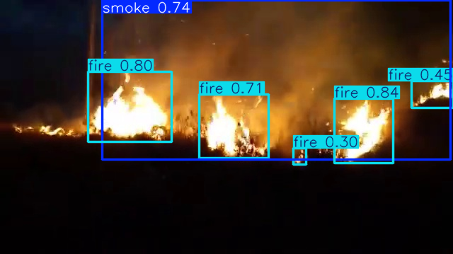
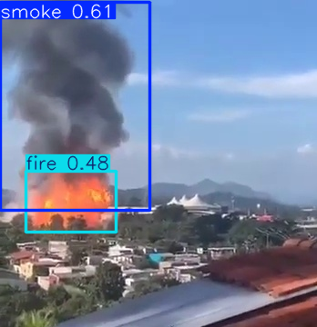
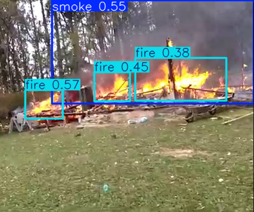

# Fire and Smoke Detection

## Description

The goal of this project is to build a real-time object detection system capable of identifying fire and smoke in images and video streams using a fine-tuned YOLO model.

The system is designed for potential real-world applications such as:
- early fire detection systems in buildings,
- robotic inspection in hazardous environments,
- assisting firefighters with situational awareness.

The model is trained using transfer learning on a pre-trained YOLO architecture and adapted for fire and smoke detection.

Detecting fire and smoke is significantly more complex than standard object detection tasks due to:
- High visual variability: fire shapes change rapidly and unpredictably
- Low structure of smoke: smoke is semi-transparent, amorphous, and hard to localize
- Confusion with similar phenomena: fog, clouds, steam, reflections, lighting effects
- Small and early-stage objects: early fire often occupies very few pixels
- Lighting dependency: performance degrades in low-light or overexposed scenes
- Annotation ambiguity: smoke boundaries are inherently subjective

These factors make fire/smoke detection a challenging real-world computer vision problem rather than a standard benchmark task.

## Dataset

The model is trained on the [DFireDataset](https://github.com/gaia-solutions-on-demand/DFireDataset).

Source: https://github.com/gaia-solutions-on-demand/DFireDataset

Classes:
- fire
- smoke

Dataset characteristics:
- Real-world and synthetic fire/smoke scenarios
- Diverse environments (indoor, outdoor, urban, industrial)
- Mixed quality annotations depending on smoke density
- Imbalanced distribution between fire and smoke instances

<!-- Preprocessing:
- YOLO format conversion
- Image resizing and normalization
- Data augmentation (flips, scaling, color jittering) -->

## Metrics

#### Evaluation:

- Precision: 0.79
- Recall: 0.74
- F1-score: 0.76
- mAP@50: 0.81
- mAP@50–95: 0.47

#### Interpretation:
The model achieves strong detection performance at IoU=0.5, with more strict localization metrics (mAP@50–95) reflecting the inherent difficulty of precise bounding box annotation for smoke.

## Example results

#### Image Detection Samples
<p align="center">    </p>

#### Video Demonstration

Firefighter POV example:

<p align="center">
  
</p>

## Prerequisites

- **Python 3.11+**
- **NVIDIA GPU** (recommended for training and real-time inference)
- **CUDA 12.x** (if using GPU acceleration)

## Installation

First, clone the repository:
```bash
git clone https://github.com/apautrat17/fire_and_smoke_detection.git
cd fire_and_smoke_detection
```

Then, create a virtual environment:
```bash
python -m venv venv
.\venv\Scripts\activate
```

Install the requirements:
```bash
pip install -r requirements.txt
```

## Test

If you want to test the project, you can modify the [configuration file](src/config/config.yaml) to changes the data processing parameters, training hyperparameters, or the other global parameters.

Then, if you want to train the model, you can run:
```bash 
python -m src.main.main --do_train
```

If you want to test a model with an image, you can run:
```bash 
python -m src.main.main --do_inference_image --image_path "path_to_your_image"
```

And if you want to test the model on a video, you can run:
```bash 
python -m src.main.main --do_inference_video --video_path "path_to_your_video"
```